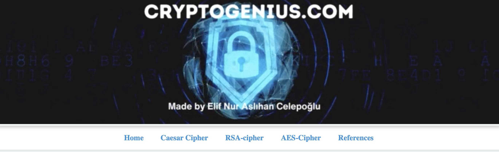
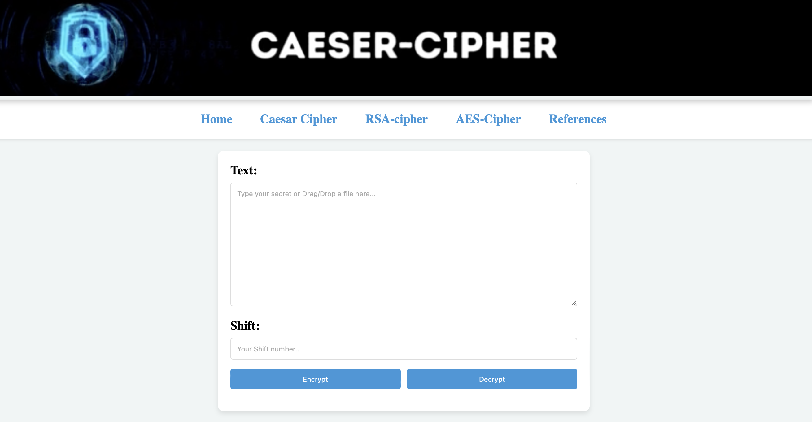
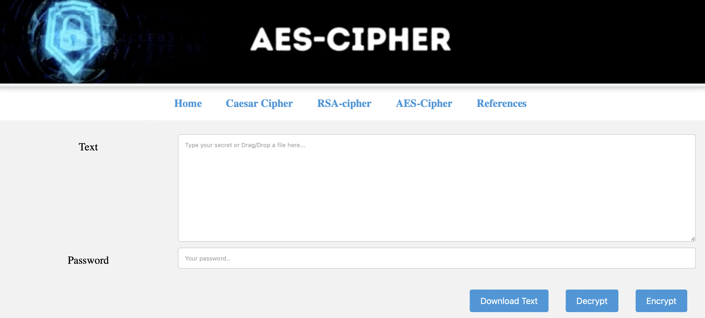
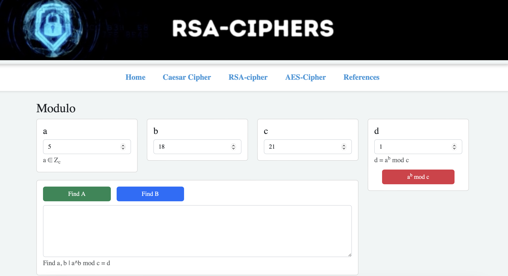

# Cryptology Encryption Decryption



https://cryptologygenius.netlify.app/home


        

## Overview
This project is a standalone web application that performs encryption and decryption using Caesar Cipher, RSA Cipher, and AES Cipher algorithms. It provides a user-friendly interface for learning and experimenting with these cryptographic techniques.

## Features
- Encryption and decryption using Caesar Cipher
- Encryption and decryption using RSA Cipher
- Encryption and decryption using AES Cipher
- Interactive web interface

## Files and Directories
- **Home.html**: Main homepage of the application.
- **RSA.html**: Interface for RSA encryption and decryption.
- **aes.html**: Interface for AES encryption and decryption.
- **caeser-cipher.html**: Interface for Caesar Cipher encryption and decryption.
- **README.md**: Project documentation.
- **Various .mp4 files**: Demonstration videos for each encryption method.
- **res.png**: Resource image for the project.
- **.gitattributes**: Git configuration file.

## Installation and Setup
1. Clone the repository:
    ```sh
    git clone https://github.com/elif1906/cryptology-encryption-decryption.git
    ```
2. Navigate to the project directory:
    ```sh
    cd cryptology-encryption-decryption
    ```
3. Open `Home.html` in a web browser to start using the application.

## Usage
- **Caesar Cipher**: Encrypt and decrypt messages by shifting characters.
- **RSA Cipher**: Encrypt and decrypt messages using RSA algorithm.
- **AES Cipher**: Encrypt and decrypt messages using AES algorithm.

## License
This project is licensed under the MIT License - see the [LICENSE](LICENSE) file for details.

For more details, visit the [GitHub repository](https://github.com/elif1906/cryptology-encryption-decryption).
